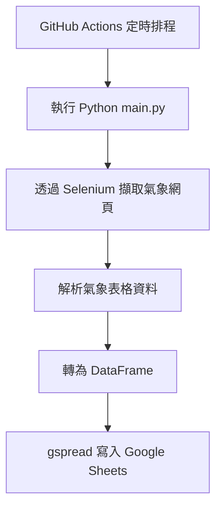

# 🌤️ 中央氣象署天氣資料自動擷取器

本專案每日自動從[中央氣象署](https://www.cwa.gov.tw/V8/C/)網站擷取台灣 22 縣市的 7 天天氣預報，包含白天與晚上各項天氣資訊，並寫入 Google Sheets，實現資料自動化收集。

---
## 🧩 功能特色

- ⏰ **每日兩次自動執行**：早上 6 點、下午 6 點（使用 GitHub Actions 定時排程）
- 🗺️ **涵蓋全台 22 縣市**：資料來源為中央氣象署官方網站
- 💡 **擷取資訊包含**：
  - 日期
  - 白天 / 晚上的最高最低溫
  - 天氣型態（如多雲、陣雨等）
  - 體感溫度
  - 紫外線指數
- 📊 **資料寫入 Google Sheets**：便於進一步視覺化或分析
- 🔒 **使用 GitHub Secrets 管理金鑰**：避免任何敏感資訊洩漏

---
## 🛠️ 使用技術
- Python 3.12
- [Selenium](https://pypi.org/project/selenium/) + Chrome Headless
- [BeautifulSoup4](https://pypi.org/project/beautifulsoup4/)：解析 HTML 結構
- [gspread](https://pypi.org/project/gspread/) + [oauth2client](https://pypi.org/project/oauth2client/)：操作 Google Sheets
- GitHub Actions：排程任務與自動化部署

---
## 📂 專案結構
```plaintext
.
├── .github/workflows/
│   └── weather.yml        # GitHub Actions 設定（每日兩次執行）
├── main.py                # 主程式：抓取資料並寫入 Sheets
├── requirements.txt       # Python 相依套件清單
└── README.md              # 專案說明文件
```

---
## 🔄 自動執行流程圖



---
## 🧪 如何本地測試

如需在本地端執行：

1. 下載 [Google Service Account 憑證 JSON](https://console.cloud.google.com/)
2. 將檔案命名為 `service_account.json`
3. 設定環境變數：
   ```bash
   export SPREADSHEET_ID="你的 Google 試算表 ID"
   ```
4. 安裝相依套件：
   ```bash
   pip install -r requirements.txt
   ```
5. 執行主程式：
   ```bash
   python main.py
   ```
---
## 📌 注意事項
- 請勿將 service_account.json 上傳至 GitHub！實際部署中使用 GitHub Secrets 保護金鑰。


---
## 📝 授權與貢獻
此專案僅供學習與展示用途，如需商用請自行擴充與保護安全驗證。

---
## 📬 聯絡方式
- 作者：陳宗葆
- Email：blueskycm@gmail.com